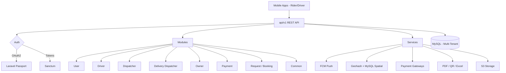

<p align="center">
  
</p>

<p align="center">
  
  
  
  
  
</p>

> **Developed by [Arslan Malik](https://github.com/arsalanmaalik461)**
> 📱 WhatsApp: [+92 300 8987448](https://wa.me/923008987448) · 🌐 Website: [arslanmalik.tech](https://arslanmalik.tech)

---

## 🌟 Executive Overview

**Arsu Bid** is a multi-tenant taxi and delivery dispatch platform built on Laravel 8. It exposes a versioned REST API (`api/v1`) that powers the full ride-hailing lifecycle: rider/driver registration and authentication, fare ETA quotes, instant and scheduled trip requests, rental packages, goods-type handling for deliveries, promo codes, and a dispatcher console for fleet operators. Multi-tenancy (via `hyn/multi-tenant`) lets a single deployment host multiple regional operators, each with isolated data.

The platform ships with production-grade supporting services: push notifications through Firebase Cloud Messaging, geospatial search using geohash and MySQL spatial extensions, OAuth2 API auth via Laravel Passport (with Sanctum and Socialite for app flows), PDF and QR-code generation, Excel import/export, and S3-compatible storage. Payments are handled through a broad gateway roster — Stripe, Razorpay, Cashfree, CCAvenue, PayPal, Braintree, and MercadoPago — so the platform can be monetized in multiple markets.

---

## 📑 Table of Contents

- [✨ Key Features & Highlights](#-key-features--highlights)
- [🖥️ Feature Showcase](#️-feature-showcase)
- [🏗️ System Architecture](#️-system-architecture)
- [🚀 Quickstart & Installation Guide](#-quickstart--installation-guide)
- [📂 Project Structure](#-project-structure)
- [🛡️ Security & Notes](#️-security--notes)

---

## ✨ Key Features & Highlights

| Feature | Description |
| :--- | :--- |
| 🚕 Taxi & Delivery Booking | Ad-hoc and scheduled trip requests with pickup/drop coordinates, addresses, and vehicle types (`routes/api/v1/request.php`) |
| 💰 ETA & Fare Quotes | Upfront fare estimates per transport type (`taxi` / `delivery`) before a booking is created |
| 🧾 Rental Packages | Configurable rental packages and promo-code support for fare discounts |
| 📦 Goods Types | Parcel/delivery bookings with goods type and quantity metadata |
| 🧑‍✈️ Driver Module | Dedicated driver API surface — profiles, availability, and trip lifecycle |
| 🖥️ Dispatcher Console | Taxi and delivery dispatcher endpoints for fleet operations and assignment |
| 🏢 Owner Panel | Operator/owner APIs for managing their tenant's business |
| 💳 Multi-Gateway Payments | Stripe, Razorpay, Cashfree, CCAvenue, PayPal, Braintree, MercadoPago |
| 🔔 Push Notifications | Firebase Cloud Messaging (`laravel-notification-channels/fcm`) |
| 📍 Geospatial Search | Geohash + MySQL spatial + Google polyline encoding for location logic |
| 🏗️ Multi-Tenant | `hyn/multi-tenant` — one deployment, many isolated operators |
| 🔐 API Auth | Laravel Passport (OAuth2), Sanctum tokens, Socialite social login |
| 📄 Reports & Utilities | DomPDF invoicing, QR codes, Excel import/export, image processing |

---

## 🖥️ Feature Showcase

### 1. Request & Booking Engine

> The heart of the platform: instant or scheduled taxi and delivery requests with upfront pricing.

- `api/v1/request/adhoc-eta` — fare estimate from pickup/drop coordinates, transport type, and promo code
- `api/v1/request/adhoc-create-request` — create a trip with coordinates, addresses, vehicle type, scheduling (`is_later`), rental package, and goods type
- `api/v1/request/adhoc-list-packages` — list rental packages available at a location
- `api/v1/common/goods-types` — goods type catalog for parcel deliveries

### 2. Multi-Tenant Fleet Platform

> One codebase serves many operators, each with isolated data, users, and configuration.

- Tenant-aware data via `hyn/multi-tenant`
- Separate API surfaces for riders (`user.php`), drivers (`driver.php`), dispatchers (`dispatcher.php`, `delivery-dispatcher.php`), and business owners (`owner.php`)
- Background workers (see `worker.log`) process queues and scheduled tasks

---

## 🏗️ System Architecture



---

## 🚀 Quickstart & Installation Guide

### Prerequisites

- PHP `^7.3|^8.2` with Composer
- MySQL (spatial extension support recommended)
- Node.js & npm (for Laravel Mix assets)
- Redis (recommended for queues/cache)

### Step-by-Step Installation

```bash
# 1. Clone the repository
git clone https://github.com/arsalanmaalik461/arsu-bid.git
cd arsu-bid

# 2. Install PHP dependencies
composer install

# 3. Environment setup
cp .env.example .env
php artisan key:generate

# 4. Configure .env (DB, queue, FCM, payment gateway keys)

# 5. Run migrations & seeders
php artisan migrate --seed

# 6. Install frontend dependencies and build assets
npm install
npm run dev        # or: npm run production

# 7. Generate Passport keys for API auth
php artisan passport:install

# 8. Serve the application
php artisan serve
```

---

## 📂 Project Structure

```
arsu-bid/
├── app/                 # Application code (models, controllers, jobs, services)
├── bootstrap/           # Framework bootstrap files
├── config/              # Laravel configuration files
├── database/
│   └── migrations/      # Database schema migrations
├── public/              # Web root (index.php, compiled assets)
├── resources/
│   ├── views/           # Blade templates
│   └── js| sass/        # Frontend source (Laravel Mix)
├── routes/
│   ├── api.php
│   └── api/v1/          # Versioned API routes
│       ├── auth.php
│       ├── common.php
│       ├── delivery-dispatcher.php
│       ├── dispatcher.php
│       ├── driver.php
│       ├── owner.php
│       ├── payment.php
│       ├── request.php
│       └── user.php
├── storage/             # Logs, cache, uploads
├── tests/               # PHPUnit test suite
├── artisan              # CLI entry point
├── composer.json        # PHP dependencies
├── package.json         # JS dependencies
├── webpack.mix.js       # Asset build config
└── phpunit.xml          # Test configuration
```

---

## 🛡️ Security & Notes

- Never commit real `.env` credentials — a `.env.save` file is present in the repo; rotate any keys found there before production use.
- Protect payment gateway keys (Stripe, Razorpay, Cashfree, CCAvenue, PayPal, Braintree, MercadoPago) with environment variables only.
- API auth is OAuth2 via Laravel Passport — keep private keys out of version control.
- Large committed files (`worker.log`, `composer.lock`, SVG artifacts) are operational byproducts; trim them if forking.
- CORS is handled via `fruitcake/laravel-cors` — restrict origins in production.
- Multi-tenant data isolation depends on `hyn/multi-tenant` — review tenant setup docs before onboarding new operators.

---

<p align="center">
  <sub>Developed with ❤️ by <a href="https://github.com/arsalanmaalik461">Arslan Malik</a> · 📱 <a href="https://wa.me/923008987448">WhatsApp: +92 300 8987448</a> · 🌐 <a href="https://arslanmalik.tech">arslanmalik.tech</a></sub>
</p>
